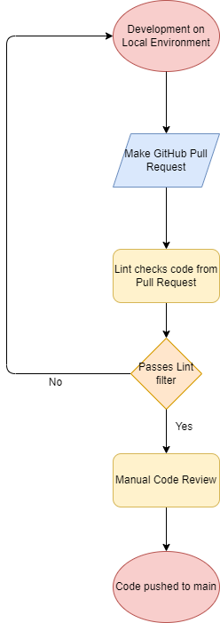

## **What we currently have**
We currently have a a linting and code style enforcement tool in our pipeline in the form of a yml file in our repository. When any one of us makes a pull request from any branch trying to merge into the dev branch, then the code we submit is checked by the linter to see if it complies with the standard of styling that we have agreed upon. At the same time, we also have manual code reviewers that are assigned to review a pull request. They will be looking out for whether the code is maintainable (e.g. has proper documentation and whether the code is unnecesarily complex - there can be a discussion between the reviewer and person who made the pull request in GitHub). Pull requests have to be approved and pass the linter before they can be merged into main or dev branch. 

## **In the works**
The most immediate thing that we want to add to our CI/CD pipeline is unit tests using a software like Jest or Cypress. Right now we don't have any systematic way to test out code - reviewers are doing manual tests of code right now which can be inconsistent from reviewer to reviewer. However, with Jest/Cypress, we can test particular components of the code, similar to JUnit. So once we incorporate end to end testin in our pipeline, code submitted in pull requests must pass all of the procedures listed in the prior section and pass the unit tests implemented. 

## **Other potential additions**
It has crossed our mind to add documentation generation, such as JSDocs, to our pipeline. If we have the time, we will look into adding it into our repository. However, it's not a big deal if we don't since we can always add documentation ourselves. 

## **Current Pipeline**

