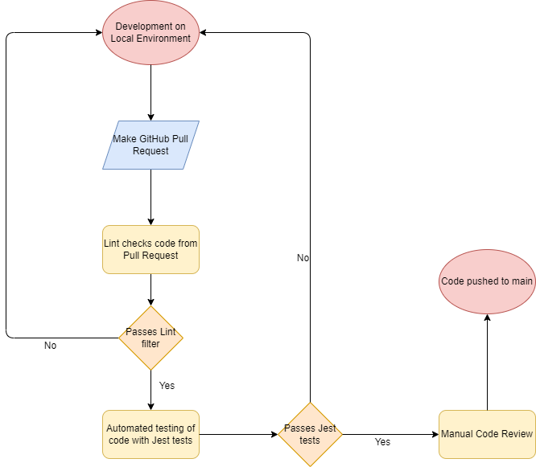

## **What we currently have**
We have a a linting and code style enforcement tool in our pipeline in the form of a yml file in our repository and test files containing unit and end-to-end tests. When any one of us makes a pull request from any branch trying to merge into the main branch, then the code we submit is checked by the linter to see if it complies with the standard of styling that we have agreed upon. In addition, the functionality of our code is tested to make sure that our webpage works as intended. At the same time, we also have manual code reviewers that are assigned to review a pull request. They will be looking out for whether the code is maintainable (e.g. has proper documentation and whether the code is unnecesarily complex - there can be a discussion between the reviewer and person who made the pull request in GitHub). Pull requests have to be approved and pass the linter + unit/end-to-end tests before they can be merged into the main branch. 

## **In the works**
The most immediate thing that we are working on adding to our CI/CD pipeline is more unit and end-to-end tests with Jest. Currently, we have tests written for the add card functionality, and some parts of the edit card functionality. However, we still need to write tests for the other parts of the edit card feature, delete card feature, sorting according to different options selected and potentially the import/export feature. We currently test these features manually which is inconsistent from reviewer to reviewer. Once we implement these additional tests, this will improve our development process and allow us to focus more on development. 

## **Other potential additions**
We are not planning on adding any new things to our pipeline.

## **Current Pipeline**

